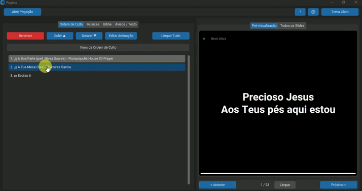

# 🎯 Projetor


## 📋 Descrição do Projeto

**Projetor** é uma aplicação desktop moderna e intuitiva desenvolvida em Python para gerenciamento e projeção de conteúdo durante cultos e reuniões religiosas. O sistema oferece uma solução completa para organizar músicas, versículos bíblicos e textos, permitindo criar uma ordem de culto estruturada e projetar slides em uma janela dedicada com animações personalizáveis.

### 🎯 Problema que Resolve

Tradicionalmente, igrejas e grupos religiosos enfrentam desafios ao gerenciar e projetar conteúdo durante cultos:
- Dificuldade em organizar músicas e versículos de forma centralizada
- Falta de uma interface intuitiva para criar e gerenciar ordens de culto
- Necessidade de ferramentas que permitam projeção profissional com animações
- Ausência de integração entre diferentes tipos de conteúdo (músicas, bíblia, textos)

O **Projetor** resolve todos esses problemas oferecendo uma plataforma única, moderna e fácil de usar.

### ✨ Por que é Útil

- **Centralização**: Tudo em um único lugar - músicas, versículos e textos
- **Eficiência**: Importação automática de letras de músicas via URL
- **Profissionalismo**: Projeção em tela dedicada com animações personalizáveis
- **Organização**: Sistema de playlist para estruturar a ordem de culto
- **Flexibilidade**: Configurações personalizáveis de fontes, cores e animações
- **Modernidade**: Interface gráfica moderna e responsiva usando CustomTkinter

---

## 📸 Screenshots / Demonstração

### Tela Principal - Ordem de Culto
 <!-- Insira aqui um print da tela principal mostrando a aba de Ordem de Culto -->

### Gerenciamento de Músicas
 <!-- Insira aqui um print da aba de Músicas com a lista de músicas cadastradas -->

### Busca de Versículos Bíblicos
 <!-- Insira aqui um print da aba da Bíblia com seletores de versão, livro, capítulo e versículo -->

### Janela de Projeção
 <!-- Insira aqui um print da janela de projeção em tela cheia com um slide sendo exibido -->

### Configurações
 <!-- Insira aqui um print do diálogo de configurações mostrando opções de personalização -->

---

## 🚀 Funcionalidades Principais

### 🎵 Gerenciamento de Músicas
- **Importação Automática**: Importe letras de músicas diretamente do site Letras.mus.br através de URL
- **Adição Manual**: Crie músicas manualmente com título, artista e letra personalizada
- **Banco de Dados Local**: Armazenamento persistente em arquivo JSON
- **Busca Rápida**: Sistema de busca eficiente com índices O(1) para localização instantânea
- **Geração Automática de Slides**: Divisão automática da letra em slides baseada em estrofes
- **CRUD Completo**: Criar, editar, excluir e visualizar músicas com interface intuitiva
- **Prevenção de Duplicatas**: Sistema inteligente que evita músicas duplicadas

### 📖 Integração com Bíblia
- **Múltiplas Versões**: Suporte a diferentes versões bíblicas através da API da Bíblia Digital
- **Navegação Intuitiva**: Seletor de versão, livro, capítulo e versículo específico
- **Cache Local**: Sistema de cache para reduzir requisições à API e melhorar performance
- **Busca por Abreviação**: Busca rápida O(1) de livros bíblicos por abreviação
- **Visualização Prévia**: Visualize versículos antes de adicionar à ordem de culto

### 📝 Texto Livre
- **Avisos e Anúncios**: Crie textos personalizados para avisos, anúncios ou mensagens especiais
- **Editor de Texto**: Interface de edição de texto completa e intuitiva
- **Projeção Imediata**: Projete textos diretamente sem necessidade de adicionar à playlist

### 🎬 Ordem de Culto (Playlist)
- **Organização Estruturada**: Crie e organize a ordem completa do culto
- **Reordenação**: Mova itens para cima ou para baixo na ordem
- **Múltiplos Tipos de Conteúdo**: Adicione músicas, versículos bíblicos e textos à mesma playlist
- **Edição de Animação**: Personalize a animação de cada item individualmente
- **Limpeza Rápida**: Limpe toda a ordem de culto com um único clique

### 🎨 Sistema de Projeção
- **Janela Dedicada**: Projeção em janela separada, ideal para uso com projetor
- **Suporte a Múltiplos Monitores**: Detecção automática e projeção no monitor secundário
- **Animações Personalizáveis**: 10 tipos diferentes de animações:
  - Aurora
  - Chamas
  - Chuva
  - Espiral
  - Estrelas Piscando
  - Neve
  - Partículas Flutuantes
  - Partículas Pulsantes
  - Pétalas
  - Poças de Luz
- **Configurações por Tipo**: Configurações independentes para músicas, bíblia e textos
- **Fundo Semi-transparente**: Opção de fundo semi-transparente atrás do texto para melhor legibilidade
- **Navegação por Teclado**: Controles intuitivos com setas e teclas de atalho

### ⚙️ Configurações e Personalização
- **Temas**: Alternância entre tema claro e escuro
- **Fontes Personalizáveis**: Tamanho de fonte configurável para cada tipo de conteúdo
- **Cores Customizáveis**: Personalize cores de texto, fundo e animações
- **Opacidade Ajustável**: Controle a opacidade do fundo do texto
- **Seleção de Monitor**: Escolha em qual monitor projetar o conteúdo

### 🎯 Interface e Usabilidade
- **Design Moderno**: Interface construída com CustomTkinter para uma experiência visual moderna
- **Pré-visualização**: Visualize slides antes de projetar
- **Miniaturas de Slides**: Visualize todos os slides em miniatura na aba "Todos os Slides"
- **Atalhos de Teclado**: Navegação rápida com teclas de atalho
- **Diálogo de Ajuda**: Guia de atalhos de teclado integrado

---

## 🛠️ Tecnologias Utilizadas

### Linguagem e Runtime
- **Python 3.10+**: Linguagem de programação principal

### Frameworks e Bibliotecas GUI
- **CustomTkinter 5.2.2**: Framework moderno para interface gráfica baseado em Tkinter
- **Tkinter**: Biblioteca nativa do Python para interfaces gráficas

### Bibliotecas de Requisições e Web Scraping
- **Requests 2.32.5**: Cliente HTTP para comunicação com APIs
- **BeautifulSoup4 4.14.2**: Biblioteca para parsing e scraping de HTML
- **Unidecode 1.4.0**: Normalização de caracteres Unicode

### Utilitários e Configuração
- **python-dotenv 1.2.1**: Gerenciamento de variáveis de ambiente
- **screeninfo 0.8.1**: Detecção e informações sobre monitores do sistema

### Ferramentas de Desenvolvimento
- **pytest**: Framework de testes (configurado em `pytest.ini`)
- **mypy**: Verificação estática de tipos (configurado em `mypy.ini`)
- **coverage**: Análise de cobertura de código (mínimo 75% configurado)

### Dependências de Suporte
- **certifi 2025.10.5**: Certificados CA para SSL/TLS
- **charset-normalizer 3.4.4**: Detecção de encoding
- **darkdetect 0.8.0**: Detecção de tema do sistema
- **idna 3.11**: Suporte a IDN
- **packaging 25.0**: Utilitários de versionamento
- **soupsieve 2.8**: Seletor CSS para BeautifulSoup
- **typing_extensions 4.15.0**: Extensões de type hints
- **urllib3 2.5.0**: Cliente HTTP de baixo nível

---

## 📋 Pré-requisitos

Antes de começar, certifique-se de ter instalado em sua máquina:

### Obrigatórios
- **Python 3.10 ou superior**: [Download Python](https://www.python.org/downloads/)
- **pip**: Gerenciador de pacotes Python (geralmente incluído com Python)

### Opcionais (mas recomendados)
- **Git**: Para clonar o repositório
- **Ambiente Virtual**: Para isolar as dependências do projeto (venv ou virtualenv)

### Sistema Operacional
- **Windows 10/11**: Testado e funcionando
- **Linux**: Compatível (requer ajustes menores)
- **macOS**: Compatível (requer ajustes menores)

---

## 🔧 Instalação e Execução

### Passo 1: Clonar o Repositório

```bash
git clone https://github.com/seu-usuario/projetor.git
cd projetor
```

Se você não tiver o Git instalado, você pode baixar o projeto como arquivo ZIP e extrair.

### Passo 2: Criar Ambiente Virtual (Recomendado)

**Windows:**
```bash
python -m venv venv
venv\Scripts\activate
```

**Linux/macOS:**
```bash
python3 -m venv venv
source venv/bin/activate
```

### Passo 3: Instalar Dependências

```bash
pip install -r requirements.txt
```

### Passo 4: Configurar Variáveis de Ambiente (Opcional)

Crie um arquivo `.env` na raiz do projeto (se necessário para configurações específicas):

```env
# Exemplo de .env (se necessário)
# BIBLE_API_KEY=sua_chave_aqui
```

### Passo 5: Executar a Aplicação

```bash
python main.py
```

A aplicação será iniciada e a janela principal será exibida.

### 🎮 Primeiros Passos

1. **Adicionar uma Música**:
   - Vá para a aba "Músicas"
   - Clique em "Importar (URL)" e cole uma URL do Letras.mus.br
   - Ou clique em "Adicionar Nova" para criar manualmente

2. **Buscar um Versículo**:
   - Vá para a aba "Bíblia"
   - Selecione versão, livro, capítulo e versículo
   - Clique em "Carregar e Visualizar"

3. **Criar Ordem de Culto**:
   - Adicione itens à ordem de culto usando os botões "Adicionar à Ordem"
   - Reordene os itens usando os botões "Subir" e "Descer"

4. **Projetar**:
   - Clique no botão "Abrir Projeção" na barra superior
   - Use as setas do teclado para navegar entre slides
   - Pressione `Esc` para fechar a projeção

---

## 📁 Estrutura do Projeto

```
projetor/
├── core/                           # Lógica de negócio e regras
│   ├── services/                   # Serviços externos
│   │   ├── bible_api_client.py    # Cliente para API da Bíblia Digital
│   │   └── letras_scraper.py      # Scraper para Letras.mus.br
│   ├── utils/                     # Utilitários compartilhados
│   │   └── file_utils.py          # Funções para manipulação de arquivos
│   ├── bible_manager.py           # Gerenciador de acesso à Bíblia
│   ├── config_manager.py          # Gerenciador de configurações
│   ├── exceptions.py              # Exceções customizadas
│   ├── logging_config.py          # Configuração de logging
│   ├── music_manager.py           # Gerenciador de músicas
│   ├── paths.py                   # Definições de caminhos
│   ├── types.py                   # Definições de tipos
│   └── validators.py              # Validadores de dados
│
├── gui/                            # Interface gráfica
│   ├── controllers/                # Controladores (lógica da interface)
│   │   ├── bible_controller.py    # Controlador da aba Bíblia
│   │   ├── music_controller.py    # Controlador da aba Músicas
│   │   ├── playlist_controller.py # Controlador da Ordem de Culto
│   │   ├── presentation_controller.py # Controlador de projeção
│   │   └── text_controller.py     # Controlador de texto livre
│   ├── ui/                         # Componentes de interface
│   │   ├── builders.py            # Funções construtoras de UI
│   │   ├── preview_pane.py        # Painel de pré-visualização
│   │   └── top_bar.py             # Barra superior
│   ├── utils/                      # Utilitários da GUI
│   │   └── dialog_utils.py        # Utilitários para diálogos
│   ├── animations.py              # Animações para projeção
│   ├── dialogs.py                 # Diálogos modais
│   ├── main_window.py             # Janela principal
│   └── projection_window.py       # Janela de projeção
│
├── data/                           # Dados persistentes
│   ├── bible_books_cache.json     # Cache de livros bíblicos
│   └── music_db.json              # Banco de dados de músicas
│
├── docs/                           # Documentação
│   └── arquitetura.md             # Documentação da arquitetura
│
├── logs/                           # Logs da aplicação
│   └── projetor.log              # Arquivo de log principal
│
├── tests/                          # Testes automatizados
│   ├── core/                      # Testes da camada core
│   │   ├── services/              # Testes de serviços
│   │   ├── test_bible_manager.py
│   │   ├── test_config_manager.py
│   │   └── test_music_manager.py
│   └── conftest.py                # Configuração do pytest
│
├── config.ini                      # Arquivo de configuração
├── main.py                         # Ponto de entrada da aplicação
├── mypy.ini                        # Configuração do mypy
├── pytest.ini                     # Configuração do pytest
├── requirements.txt                # Dependências do projeto
└── README.md                       # Este arquivo
```

### 📝 Descrição das Pastas Principais

- **`core/`**: Contém toda a lógica de negócio, gerenciadores de dados, serviços externos e utilitários. Esta camada é independente da interface gráfica.

- **`gui/`**: Contém todos os componentes da interface gráfica, incluindo janelas, controladores, componentes reutilizáveis e animações.

- **`data/`**: Armazena dados persistentes em formato JSON (banco de músicas e cache de livros bíblicos).

- **`tests/`**: Contém os testes automatizados do projeto, organizados por camada.

- **`docs/`**: Documentação adicional do projeto, incluindo arquitetura e design.

- **`logs/`**: Arquivos de log gerados pela aplicação durante a execução.

---

## 👤 Autor

**Desenvolvido com ❤️ para facilitar a projeção de conteúdo em cultos e reuniões religiosas.**

---

## 📄 Licença

Este projeto está sob a licença MIT. Veja o arquivo `LICENSE` para mais detalhes.

---

## 🙏 Agradecimentos

- **CustomTkinter**: Pela excelente biblioteca de interface gráfica moderna
- **API da Bíblia Digital**: Pelo acesso gratuito aos textos bíblicos
- **Letras.mus.br**: Pela disponibilização de letras de músicas
- **Comunidade Python**: Pelo suporte e recursos incríveis

